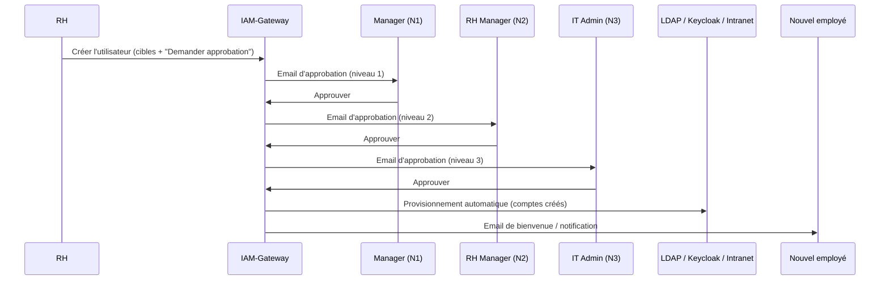

# Guide d'utilisation — IAM-Gateway

**Plateforme web d'administration des identités et des accès (IAM)**

| | |
|---|---|
| **Projet** | IAM-Gateway — SAÉ « Projet 3 » |
| **Formation** | BUT Informatique, 3ᵉ année — UPEC |
| **Type de document** | Guide utilisateur (manuel d'utilisation) |
| **Public visé** | Utilisateurs métiers : RH, managers, administrateurs IT |
| **Auteurs** | Zhmuryk Andrii · Aydin Ibrahim |
| **Co-auteur (livrables générés)** | achibani@gmail.com |

---

## Table des matières

- [Introduction](#introduction)
- [Module 1 — Authentification](#module-1--authentification)
- [Module 2 — Tableau de bord](#module-2--tableau-de-bord)
- [Module 3 — Gestion des utilisateurs IAM](#module-3--gestion-des-utilisateurs-iam)
- [Module 4 — Provisionnement](#module-4--provisionnement)
- [Module 5 — Workflows d'approbation](#module-5--workflows-dapprobation)
- [Module 6 — Connecteurs](#module-6--connecteurs)
- [Module 7 — Règles de provisionnement](#module-7--règles-de-provisionnement)
- [Module 8 — Réconciliation](#module-8--réconciliation)
- [Module 9 — Journal d'audit](#module-9--journal-daudit)
- [Module 10 — Administration](#module-10--administration)
- [Cas d'usage métiers complets](#cas-dusage-métiers-complets)
- [Utilisation mobile / responsive](#utilisation-mobile--responsive)
- [Glossaire métier](#glossaire-métier)

---

# Introduction

## Qu'est-ce qu'IAM-Gateway ?

**IAM-Gateway** est une plateforme web qui centralise la **gestion des identités et des accès** dans votre organisation. Concrètement, elle permet de **créer, modifier, désactiver et supprimer les comptes des employés** dans plusieurs systèmes informatiques **en une seule opération**, au lieu de le faire manuellement dans chaque application.

Lorsqu'un nouvel employé arrive, plutôt que de créer son compte séparément dans l'annuaire (LDAP), l'ERP (Odoo), le système RH (intranet) et l'outil de connexion unique (Keycloak), IAM-Gateway orchestre **tout automatiquement** à partir d'une seule fiche, en respectant un circuit de validation (workflow d'approbation).

### Cas d'usage métier principaux

| Situation | Ce que fait IAM-Gateway |
|---|---|
| **Arrivée d'un employé** (onboarding) | Crée tous les comptes nécessaires après validation hiérarchique. |
| **Départ d'un employé** (offboarding) | Désactive/supprime tous les accès simultanément. |
| **Changement de poste/service** | Met à jour les droits et attributs dans tous les systèmes. |
| **Audit de conformité** | Trace toutes les actions et détecte les écarts entre systèmes. |
| **Approbation à distance** | Permet à un manager de valider une demande depuis son mobile. |

## Navigateurs compatibles

L'application est une **application web moderne**. Navigateurs recommandés :

| Navigateur | Version | Statut |
|---|---|---|
| Google Chrome / Chromium | récente | ✅ Recommandé |
| Microsoft Edge | récente | ✅ Recommandé |
| Mozilla Firefox | récente | ✅ Compatible |
| Safari | récente | ✅ Compatible |

> 💡 **Conseil :** activez JavaScript (activé par défaut) et autorisez les cookies pour l'origine de l'application. Pour une expérience optimale, utilisez un écran d'au moins 1280 px de large pour les modules de configuration.

## Accès et prérequis

Selon votre rôle, vous accédez à différentes interfaces :

| Interface | URL (environnement local) | Pour qui |
|---|---|---|
| **Console IAM-Gateway** (principale) | http://localhost:3000 | Tous les utilisateurs métiers |
| **API / Documentation** (Swagger) | http://localhost:8000/docs | Administrateurs techniques |
| **MidPoint** (gouvernance) | http://localhost:8080/midpoint | Administrateurs IAM |
| **Keycloak** (connexion unique) | http://localhost:8081 | Administrateurs IT |
| **phpLDAPadmin** (annuaire) | http://localhost:8088 | Administrateurs IT |
| **Odoo** (ERP) | http://localhost:8069 | Administrateurs IT |

> ℹ️ En production, ces adresses `localhost` sont remplacées par les URLs publiques sécurisées (HTTPS) communiquées par votre service informatique.

## Les rôles utilisateurs

Vos droits dans l'application dépendent du **rôle** qui vous est attribué :

| Rôle | Droits | Profil métier type |
|---|---|---|
| **admin** | Accès complet à tous les modules, y compris l'administration. | Responsable IAM / IT |
| **iam_engineer** | Connecteurs, règles, provisionnement. Pas d'administration système. | Ingénieur IAM |
| **manager** | Approbation des workflows, consultation des audits. | Manager / responsable d'équipe |
| **viewer** | Consultation uniquement (lecture seule). | Auditeur, observateur |

> 💡 Si un menu ou un bouton n'apparaît pas pour vous, c'est probablement que votre rôle ne dispose pas du droit correspondant. Contactez un administrateur.

---

# Module 1 — Authentification

## 1.1 À qui s'adresse ce module

À **tous les utilisateurs**. La connexion est l'étape obligatoire avant d'accéder à la moindre fonctionnalité.

## 1.2 Comment y accéder

Ouvrez la console à l'adresse **http://localhost:3000**. Si vous n'êtes pas connecté, vous êtes automatiquement redirigé vers la page de connexion (`/login`).

## 1.3 Description de l'interface

> 📸 **[SCREENSHOT]** : Page de connexion.
> *Éléments visibles : logo IAM-Gateway centré, un champ « Nom d'utilisateur », un champ « Mot de passe » (masqué), un bouton « Se connecter », éventuel sélecteur de langue (FR/EN/UK) en haut à droite.*

## 1.4 Procédure de connexion

1. Saisissez votre **nom d'utilisateur** (ex. `admin`).
2. Saisissez votre **mot de passe** (ex. `admin123` pour le compte par défaut).
3. Cliquez sur **Se connecter**.
4. En cas de succès, vous êtes redirigé vers le **tableau de bord**.

> ⚠️ **Sécurité du jeton de session.** Après connexion, l'application reçoit un **jeton JWT valable 60 minutes**. Passé ce délai, vous devrez vous reconnecter. C'est normal et volontaire pour limiter les risques.

## 1.5 Déconnexion

1. Cliquez sur votre nom/avatar en haut à droite.
2. Sélectionnez **Se déconnecter**.

> 💡 La déconnexion **révoque immédiatement** votre jeton (il est mis sur liste noire côté serveur) : même copié, il ne pourra plus être réutilisé. Déconnectez-vous toujours sur un poste partagé.

## 1.6 Messages d'erreur courants

| Message | Cause | Solution |
|---|---|---|
| « Identifiants incorrects » (401) | Mauvais nom d'utilisateur ou mot de passe. | Vérifiez la saisie ; attention aux majuscules. |
| « Session expirée », redirection vers /login | Jeton JWT expiré (> 60 min). | Reconnectez-vous. |
| « Token has been revoked » | Vous vous êtes déconnecté ailleurs / jeton révoqué. | Reconnectez-vous. |

---

# Module 2 — Tableau de bord

## 2.1 À qui s'adresse ce module

À **tous les rôles**. C'est la page d'accueil après connexion, offrant une vue synthétique de l'état du système.

## 2.2 Comment y accéder

Page d'accueil par défaut après connexion, ou via le menu latéral → **Tableau de bord** (`/dashboard`).

## 2.3 Description de l'interface

> 📸 **[SCREENSHOT]** : Tableau de bord principal.
> *Éléments visibles : barre de navigation latérale gauche (Tableau de bord, Utilisateurs, Provisionnement, Workflows, Connecteurs, Règles, Réconciliation, Audit, Administration) ; en haut, une rangée de cartes statistiques (« Opérations totales », « En attente d'approbation », « Connecteurs sains », « Alertes ») ; au centre, un graphique d'activité récente et une liste des dernières opérations ; un panneau « Alertes actives » à droite.*

## 2.4 Ce que vous y trouvez

| Indicateur | Signification |
|---|---|
| **Opérations totales** | Nombre d'opérations de provisionnement enregistrées. |
| **En attente d'approbation** | Demandes bloquées tant qu'un workflow n'est pas validé. |
| **Statut des connecteurs** | Nombre de systèmes cibles « sains » / « en erreur ». |
| **Opérations en cours** | Opérations actuellement `IN_PROGRESS`. |
| **Alertes actives** | Échecs, connecteurs en erreur, workflows expirés. |
| **Audit récent** | Derniers événements (création, modification, connexion…). |

## 2.5 Procédure : consulter une alerte

1. Repérez le panneau **Alertes actives**.
2. Cliquez sur une alerte pour ouvrir le détail.
3. Le lien vous redirige vers l'élément concerné (opération échouée, connecteur en erreur…).

> 💡 Consultez le tableau de bord en début de journée pour repérer d'un coup d'œil les demandes en attente et les incidents.

---

# Module 3 — Gestion des utilisateurs IAM

## 3.1 À qui s'adresse ce module

Aux **administrateurs IT, ingénieurs IAM et RH**. C'est ici que l'on visualise et gère les identités centralisées dans MidPoint (le moteur de gouvernance).

## 3.2 Comment y accéder

Menu latéral → **Utilisateurs**.

## 3.3 Description de l'interface

> 📸 **[SCREENSHOT]** : Liste des utilisateurs IAM.
> *Éléments visibles : un champ de recherche en haut, des filtres (Département, Statut actif/inactif) ; un tableau avec les colonnes Nom complet, Email, Département, Fonction, Statut (badge vert « Actif » / gris « Inactif »), Actions (icônes Voir / Modifier / Désactiver / Supprimer) ; un bouton « + Nouvel utilisateur » en haut à droite ; pagination en bas.*

### Champs d'une fiche utilisateur

| Champ | Description |
|---|---|
| `oid` | Identifiant unique de l'utilisateur dans MidPoint. |
| `name` / `fullName` | Identifiant de connexion / nom complet affiché. |
| `firstname` / `lastname` | Prénom / nom. |
| `email` | Adresse email professionnelle. |
| `employeeNumber` | Matricule employé. |
| `department` | Service / direction. |
| `title` | Intitulé de poste. |
| `telephoneNumber` | Téléphone. |
| `active` | Compte actif ou désactivé. |
| `roles` | Rôles assignés (déterminent les systèmes cibles provisionnés). |
| `shadows` | Comptes projetés (« reflets ») sur les systèmes cibles. |

## 3.4 Procédure : rechercher et filtrer

1. Saisissez un nom, email ou matricule dans la barre de **recherche**.
2. Affinez avec les **filtres** (département, statut).
3. La liste se met à jour automatiquement.

## 3.5 Procédure : consulter la fiche détaillée d'un utilisateur

1. Cliquez sur l'icône **Voir** (œil) d'une ligne, ou sur le nom de l'utilisateur.
2. La fiche affiche les attributs, les rôles, et l'onglet **Comptes cibles (shadows)**.

> 📸 **[SCREENSHOT]** : Fiche détaillée d'un utilisateur.
> *Éléments visibles : en-tête avec nom complet + badge statut ; onglets « Informations », « Rôles », « Comptes cibles » ; sous « Comptes cibles », une liste indiquant pour chaque système (LDAP, Odoo, Intranet, Keycloak) l'état de provisionnement (créé / absent) et l'identifiant du compte.*

## 3.6 Procédure : créer un nouvel utilisateur

1. Cliquez sur **+ Nouvel utilisateur**.
2. Renseignez les champs obligatoires :

| Champ | Obligatoire | Exemple |
|---|---|---|
| Prénom | ✅ | Jean |
| Nom | ✅ | Dupont |
| Email | ✅ | jean.dupont@example.com |
| Matricule | ⚙️ | EMP2026-014 |
| Département | ⚙️ | Informatique |
| Fonction | ⚙️ | Développeur |
| Systèmes cibles | ✅ | LDAP, Keycloak, Intranet |

3. Sélectionnez les **systèmes cibles** à provisionner.
4. (Optionnel) Cochez **Demander une approbation** pour déclencher un workflow.
5. Cliquez sur **Créer**.

> 💡 La création passe par le module **Provisionnement** : si l'approbation est requise, l'utilisateur ne sera réellement créé dans les systèmes cibles qu'**après validation complète** du workflow.

## 3.7 Procédure : modifier / désactiver / supprimer

1. Depuis la liste, cliquez sur l'action voulue (**Modifier**, **Désactiver**, **Supprimer**).
2. Pour une **modification** : ajustez les attributs puis **Enregistrer**.
3. Pour une **désactivation** : confirmez ; les comptes cibles sont désactivés sans être détruits (réversible).
4. Pour une **suppression** : confirmez ; ⚠️ action destructrice sur tous les systèmes cibles.

> ⚠️ **Désactiver vs Supprimer.** Préférez **Désactiver** lors d'un départ : les comptes sont neutralisés mais conservés (utile pour l'audit et une éventuelle réactivation). **Supprimer** efface définitivement les comptes cibles.

## 3.8 Messages d'erreur courants

| Message | Cause | Solution |
|---|---|---|
| « User not found in MidPoint » (404) | L'utilisateur n'existe pas / OID erroné. | Rafraîchissez la liste. |
| « MidPoint is not enabled » | Le mode hub est désactivé. | Contactez l'administrateur (config `MIDPOINT_ENABLED`). |
| « Insufficient permissions » (403) | Votre rôle ne permet pas cette action. | Demandez à un admin/iam_engineer. |

---

# Module 4 — Provisionnement

## 4.1 À qui s'adresse ce module

Aux **administrateurs et ingénieurs IAM** (`admin`, `iam_engineer`). C'est le cœur opérationnel : il exécute les actions de création/modification de comptes sur les systèmes cibles.

## 4.2 Comment y accéder

Menu latéral → **Provisionnement**.

## 4.3 Description de l'interface

> 📸 **[SCREENSHOT]** : Liste des opérations de provisionnement.
> *Éléments visibles : un tableau avec colonnes ID opération, Compte, Type d'opération (badge CREATE/UPDATE/DELETE…), Systèmes cibles, Statut (badge coloré), Date ; filtres par statut et par compte ; bouton « + Nouvelle opération » ; pour chaque ligne en échec, une action « Rollback ».*

### Types d'opération

| Type | Effet |
|---|---|
| `CREATE` | Créer un compte. |
| `UPDATE` | Mettre à jour les attributs. |
| `DELETE` | Supprimer le compte. |
| `DISABLE` | Désactiver (réversible). |
| `ENABLE` | Réactiver. |
| `ASSIGN_ROLE` | Assigner un rôle (déclenche un provisionnement cible). |
| `REVOKE_ROLE` | Retirer un rôle. |
| `SYNC` | Synchroniser. |

### Statuts d'une opération

```
PENDING → IN_PROGRESS → SUCCESS
                      ↘ FAILED  (→ Rollback possible)
PENDING → AWAITING_APPROVAL → (après validation) → IN_PROGRESS → SUCCESS
```

| Statut | Signification |
|---|---|
| `PENDING` | En file d'attente. |
| `AWAITING_APPROVAL` | Bloquée tant qu'un workflow n'est pas approuvé. |
| `IN_PROGRESS` | En cours d'exécution sur les cibles. |
| `SUCCESS` | Terminée avec succès. |
| `FAILED` | Échec (un rollback peut être déclenché). |
| `ROLLED_BACK` | Annulée (compensée). |

## 4.4 Procédure : créer une opération de provisionnement

1. Cliquez sur **+ Nouvelle opération**.
2. Choisissez le **type d'opération** (ex. `CREATE`).
3. Indiquez le **compte** concerné et ses **attributs**.
4. Sélectionnez les **systèmes cibles**.
5. (Optionnel) Activez **Demander une approbation**.
6. Cliquez sur **Lancer**.

## 4.5 Procédure : suivre le statut d'une opération

1. Repérez l'opération dans la liste (ou via son ID).
2. Le **badge de statut** indique l'avancement en temps réel.
3. Cliquez sur la ligne pour voir le détail (attributs calculés, résultat par cible, message d'erreur éventuel).

## 4.6 Procédure : effectuer un rollback

1. Sur une opération en statut `FAILED` (ou `SUCCESS` à annuler), cliquez sur **Rollback**.
2. Confirmez.
3. Le système exécute les actions compensatoires (ex. suppression d'un compte partiellement créé).

> 💡 Le rollback s'appuie sur des « actions de compensation » enregistrées pendant l'opération. Il est surtout utile après un **échec partiel** (création réussie sur LDAP mais échouée sur Odoo, par exemple).

## 4.7 Messages d'erreur courants

| Message | Cause | Solution |
|---|---|---|
| « Provisioning failed: … » (500) | Un système cible a rejeté l'opération. | Consultez le détail + le module Connecteurs (santé). |
| « Only completed operations can be rolled back » | Rollback demandé sur une opération non terminée. | Attendez `SUCCESS`/`FAILED`. |
| Statut bloqué sur `AWAITING_APPROVAL` | Workflow non encore approuvé. | Voir module Workflows. |

---

# Module 5 — Workflows d'approbation

## 5.1 À qui s'adresse ce module

Principalement aux **managers et approbateurs** (`manager`, RH, IT admin). Il gère le circuit de validation des demandes sensibles.

## 5.2 Le circuit d'approbation à 3 niveaux

Par défaut, une demande suit une **chaîne séquentielle à trois niveaux** :

```
Niveau 1 — Manager  →  Niveau 2 — RH Manager  →  Niveau 3 — IT Admin
```

Chaque niveau doit approuver pour passer au suivant. **Un seul rejet, à n'importe quel niveau, annule toute la demande.** Le niveau 3 (IT Admin) est configuré pour **auto-approuver après expiration** du délai, les niveaux 1 et 2 non.

> 💡 Des variantes existent (« manager uniquement », « RH + IT ») selon la configuration du workflow choisi.

## 5.3 Comment y accéder

Menu latéral → **Workflows**.

## 5.4 Description de l'interface

> 📸 **[SCREENSHOT]** : Liste des approbations en attente.
> *Éléments visibles : onglets « En attente » / « Historique » ; cartes ou tableau listant chaque demande (Nom de l'utilisateur concerné, Opération, Niveau courant « 1/3 », Demandeur, Date) ; pour chaque demande, deux boutons « Approuver » (vert) et « Rejeter » (rouge) ; au clic, un champ de commentaire s'ouvre.*

## 5.5 Procédure : approuver une demande

1. Ouvrez l'onglet **En attente**.
2. Repérez la demande (vous ne voyez que celles relevant de votre niveau/rôle).
3. Cliquez sur **Approuver**.
4. (Recommandé) Saisissez un **commentaire** justifiant la décision.
5. Confirmez.
6. Si votre niveau était le dernier, la demande passe en **approuvée** et le provisionnement s'exécute. Sinon, la demande est transmise au **niveau suivant** (notification automatique).

## 5.6 Procédure : rejeter une demande

1. Cliquez sur **Rejeter**.
2. Saisissez un **commentaire** (fortement recommandé : il explique le motif au demandeur).
3. Confirmez.
4. Le **workflow entier est rejeté** ; le demandeur est notifié par email.

## 5.7 Approbation par email (sans se connecter)

À chaque niveau, l'approbateur reçoit un **email** contenant deux liens sécurisés :

- **Approuver** (porte un `approve_token` unique)
- **Rejeter** (porte un `reject_token` unique)

> 💡 **Pratique en déplacement :** un manager peut approuver/rejeter directement depuis l'email sur son téléphone, sans ouvrir la console. Le lien est à usage unique et lié au niveau courant.

## 5.8 Procédure : suivre l'état d'un workflow

1. Ouvrez une demande (ou l'onglet **Historique**).
2. Vous voyez la **progression niveau par niveau** : qui a approuvé, quand, avec quel commentaire.

> 📸 **[SCREENSHOT]** : Détail d'un workflow multi-niveaux.
> *Éléments visibles : une frise verticale des 3 niveaux (Manager → RH → IT) avec, pour chacun, un badge (✓ Approuvé / ⏳ En attente / ✗ Rejeté), le nom du décideur, la date et le commentaire ; un encart « Historique des décisions » listant chaque événement horodaté.*

## 5.9 Expiration des demandes

Chaque niveau a un **délai** (ex. 48 h pour Manager et RH, 24 h pour IT). À expiration :
- Niveaux **sans** auto-approbation → la demande passe en **`expired`**.
- Niveau IT (**avec** auto-approbation) → la demande est **auto-approuvée**.

## 5.10 Messages d'erreur courants

| Message | Cause | Solution |
|---|---|---|
| « Workflow deja traite » | Demande déjà approuvée/rejetée/expirée. | Rafraîchissez ; aucune action possible. |
| « Token invalide » | Lien email expiré ou déjà utilisé. | Utilisez la console pour décider. |
| « Workflow non trouve » | Identifiant erroné. | Revenez à la liste. |

---

# Module 6 — Connecteurs

## 6.1 À qui s'adresse ce module

Aux **administrateurs et ingénieurs IAM**. Il déclare et surveille les systèmes cibles avec lesquels IAM-Gateway dialogue.

## 6.2 Comment y accéder

Menu latéral → **Connecteurs**.

## 6.3 Description de l'interface

> 📸 **[SCREENSHOT]** : Liste des connecteurs.
> *Éléments visibles : des cartes (une par connecteur) affichant l'icône du type (base de données, annuaire, ERP…), le nom, le sous-type (PostgreSQL, OpenLDAP, Odoo…), un badge de santé (🟢 Healthy / 🔴 Unhealthy / ⚪ Unknown), un badge de synchronisation MidPoint, et des boutons « Tester », « Modifier », « Synchroniser » ; un bouton « + Ajouter un connecteur » en haut.*

### Types de connecteurs supportés

| Catégorie | Sous-types |
|---|---|
| **SQL** | PostgreSQL, MySQL, Oracle, SQL Server, MariaDB |
| **LDAP** | OpenLDAP, Active Directory, FreeIPA |
| **REST** | Keycloak, Firebase, GLPI, REST générique |
| **ERP** | Odoo, SAP |
| **IGA** | MidPoint, SailPoint, Saviynt |

### Statuts de santé

| Badge | Signification |
|---|---|
| 🟢 **healthy** | Le connecteur répond, la connexion fonctionne. |
| 🔴 **unhealthy** | Connexion impossible (mauvais identifiants, service arrêté…). |
| ⚪ **unknown** | Pas encore testé. |

## 6.4 Procédure : ajouter un connecteur (assistant)

1. Cliquez sur **+ Ajouter un connecteur**.
2. Choisissez le **type** (SQL, LDAP, REST, ERP…) puis le **sous-type** (ex. PostgreSQL).
3. Le formulaire s'**adapte automatiquement** au sous-type choisi (les champs requis changent).

   Exemple pour **PostgreSQL** :

   | Champ | Obligatoire | Exemple |
   |---|---|---|
   | Host | ✅ | intranet-db |
   | Port | ✅ | 5432 |
   | Base de données | ✅ | intranet |
   | Utilisateur | ✅ | intranet |
   | Mot de passe | ✅ | •••••• |
   | Mode SSL | ⚙️ | prefer |

4. Donnez un **nom** et un **nom d'affichage** au connecteur.
5. (Recommandé) Cliquez sur **Tester** avant d'enregistrer.
6. (Optionnel) Cochez **Créer automatiquement la ressource dans MidPoint**.
7. Cliquez sur **Enregistrer**.

> 💡 L'assistant génère le formulaire à partir d'un « schéma » prédéfini par sous-type : vous n'avez jamais à deviner quels champs remplir.

## 6.5 Procédure : tester un connecteur

1. Sur la carte du connecteur, cliquez sur **Tester**.
2. Le badge de santé se met à jour (🟢 / 🔴) et un message indique le résultat (et le temps de réponse).

## 6.6 Procédure : synchroniser avec MidPoint

1. Cliquez sur **Synchroniser** sur la carte du connecteur.
2. Le statut de synchronisation évolue : `not_synced` → `syncing` → `synced` (ou `sync_error`).

| Statut MidPoint | Signification |
|---|---|
| `not_synced` | Pas encore lié à MidPoint. |
| `synced` | Ressource MidPoint créée et à jour. |
| `out_of_sync` | Désynchronisé (re-synchroniser). |
| `sync_error` | Erreur lors de la synchronisation. |

## 6.7 Messages d'erreur courants

| Message | Cause | Solution |
|---|---|---|
| Badge 🔴 « Connection test failed » | Hôte/port/identifiants erronés ou service arrêté. | Vérifiez les paramètres et que le système cible tourne. |
| « Invalid SQL identifier » | Nom de colonne non conforme. | Corrigez le mapping (caractères autorisés uniquement). |
| `sync_error` | MidPoint indisponible ou config incomplète. | Vérifiez MidPoint + relancez la synchro. |

---

# Module 7 — Règles de provisionnement

## 7.1 À qui s'adresse ce module

Aux **ingénieurs IAM**. Les règles définissent **comment calculer les attributs** des comptes cibles à partir des données source (ex. fabriquer le login à partir du prénom et du nom).

## 7.2 Comment y accéder

Menu latéral → **Règles**.

## 7.3 Description de l'interface

> 📸 **[SCREENSHOT]** : Liste des règles + éditeur.
> *Éléments visibles : tableau des règles (Nom, Système cible, Attribut cible, Priorité, Statut actif) ; un éditeur de code (Monaco) montrant l'expression Jinja2 d'une règle ; un panneau « Tester la règle » avec un formulaire de données d'exemple et un bouton « Exécuter » ; bouton « + Nouvelle règle ».*

### Exemple de règles pour LDAP

| Attribut cible | Expression (template) | Résultat pour Jean Dupont (EMP014) |
|---|---|---|
| `uid` | `{{ employee_id }}` | `EMP014` |
| `cn` | `{{ first_name }} {{ last_name }}` | `Jean Dupont` |
| `mail` | `{{ email }}` | `jean.dupont@example.com` |

> 💡 Les règles d'un même système cible sont appliquées **par ordre de priorité décroissante**, et le résultat d'une règle peut servir d'entrée à la suivante (chaînage).

## 7.4 Procédure : créer / modifier une règle

1. Cliquez sur **+ Nouvelle règle** (ou l'icône **Modifier** d'une règle existante).
2. Renseignez :

| Champ | Description |
|---|---|
| Nom | Nom unique de la règle. |
| Système cible | LDAP, SQL, ODOO… |
| Attribut cible | L'attribut à calculer (ex. `uid`). |
| Expression | Le template (ex. `{{ first_name }}.{{ last_name }}`). |
| Priorité | Plus élevé = exécuté en premier. |
| Conditions | (Optionnel) conditions d'application. |

3. Cliquez sur **Tester** (voir 7.5) pour valider.
4. Cliquez sur **Enregistrer**.

## 7.5 Procédure : tester une règle

1. Dans le panneau **Tester la règle**, saisissez des **données d'exemple** (prénom, nom, email…).
2. Cliquez sur **Exécuter**.
3. Le résultat calculé s'affiche, ainsi que le temps d'exécution (ou un message d'erreur).

## 7.6 Versionnement des règles

À chaque modification, une **nouvelle version** est conservée. Vous pouvez consulter l'historique des versions et, le cas échéant, restaurer une version antérieure.

> ⚠️ **Note importante.** Selon la configuration de votre installation, la persistance des règles peut être partielle. **Vérifiez après enregistrement** que votre règle est bien sauvegardée avant de compter dessus en production. En cas de doute, contactez votre administrateur.

## 7.7 Messages d'erreur courants

| Message | Cause | Solution |
|---|---|---|
| « Rule … execution error » | Erreur de syntaxe Jinja2 ou variable absente. | Corrigez l'expression ; testez avec des données complètes. |
| « Rule not found » | Règle inexistante. | Rafraîchissez la liste. |

---

# Module 8 — Réconciliation

## 8.1 À qui s'adresse ce module

Aux **administrateurs et auditeurs**. La réconciliation **compare** l'état de référence (MidPoint) avec les systèmes cibles pour détecter les **écarts**.

## 8.2 Comment y accéder

Menu latéral → **Réconciliation**.

## 8.3 Description de l'interface

> 📸 **[SCREENSHOT]** : Tableau de bord de réconciliation.
> *Éléments visibles : un bouton « Lancer une réconciliation » avec sélection des systèmes cibles ; un tableau des jobs (ID, Cibles, Statut, Comptes traités, Écarts trouvés, Date) ; au clic sur un job, la liste des écarts avec leur type et une action « Résoudre ».*

### Types d'écarts détectés

| Type | Signification | Recommandation |
|---|---|---|
| `missing_in_target` | Présent dans MidPoint, absent du système cible. | Créer le compte dans la cible. |
| `missing_in_midpoint` | Compte « orphelin » dans la cible, inconnu de MidPoint. | Importer dans MidPoint ou supprimer l'orphelin. |
| `attribute_mismatch` | Attributs différents entre MidPoint et la cible. | Synchroniser depuis MidPoint. |

## 8.4 Procédure : lancer un job de réconciliation

1. Cliquez sur **Lancer une réconciliation**.
2. Sélectionnez les **systèmes cibles** (ex. LDAP, SQL, Odoo).
3. Cliquez sur **Démarrer**.
4. Le job passe en `in_progress` ; suivez la progression (comptes total / traités / écarts trouvés).

## 8.5 Procédure : consulter et résoudre les écarts

1. Cliquez sur un job **terminé** pour ouvrir la liste des écarts.
2. Pour chaque écart, choisissez une **action de résolution** :

| Action | Effet |
|---|---|
| **Utiliser MidPoint** | Provisionne / met à jour la cible depuis MidPoint. |
| **Utiliser la cible** | Importe / met à jour MidPoint depuis la cible. |
| **Supprimer l'orphelin** | Supprime le compte cible non référencé. |
| **Ignorer** | Marque l'écart comme traité sans action. |

3. Confirmez. Le bilan indique le nombre d'écarts résolus et les éventuelles erreurs.

> 💡 Lancez une réconciliation **périodiquement** (ex. hebdomadaire) ou après un incident, pour garantir la cohérence entre tous les systèmes.

## 8.6 Messages d'erreur courants

| Message | Cause | Solution |
|---|---|---|
| Job en `failed` | MidPoint ou une cible indisponible. | Vérifiez les connecteurs et relancez. |
| Écart non résolu (erreur) | Le système cible a rejeté l'action. | Consultez le détail de l'erreur de l'écart. |

---

# Module 9 — Journal d'audit

## 9.1 À qui s'adresse ce module

Aux **auditeurs, managers et administrateurs**. Il trace **toutes les actions** réalisées dans la plateforme (qui, quoi, quand, sur quel système).

## 9.2 Comment y accéder

Menu latéral → **Audit**.

## 9.3 Description de l'interface

> 📸 **[SCREENSHOT]** : Journal d'audit.
> *Éléments visibles : une barre de filtres (Type d'événement, Sévérité, Système cible, Compte, plage de dates) ; un champ de recherche libre/sémantique ; un tableau (Date, Type, Sévérité avec badge coloré, Acteur, Action, Système cible, Statut) ; un bouton « Exporter » ; au clic sur une ligne, un panneau de détail (changements, IP de l'acteur…).*

### Filtres disponibles

| Filtre | Valeurs |
|---|---|
| **Type d'événement** | `PROVISION`, `RECONCILIATION`, `WORKFLOW`, `AUTH`, `SYSTEM`, `ERROR` |
| **Sévérité** | `DEBUG`, `INFO`, `WARNING`, `ERROR`, `CRITICAL` |
| **Système cible** | LDAP, Odoo, Intranet, Keycloak… |
| **Compte** | Identifiant de l'utilisateur concerné |
| **Période** | Plage de dates |

## 9.4 Procédure : rechercher dans les logs

1. Renseignez un ou plusieurs **filtres**.
2. (Option) Saisissez une **recherche en langage naturel** dans le champ de recherche sémantique (ex. « échecs de création sur LDAP la semaine dernière »).
3. La liste se met à jour ; cliquez sur une ligne pour le détail.

> 💡 **Recherche sémantique par IA.** Au-delà des filtres classiques, la recherche sémantique (propulsée par une base vectorielle) retrouve des événements par le **sens** de votre requête, même sans mots-clés exacts. Très utile pour les investigations.

## 9.5 Procédure : exporter les logs

1. Appliquez les filtres souhaités (type, période…).
2. Cliquez sur **Exporter**.
3. Le fichier est téléchargé (utile pour un rapport de conformité).

## 9.6 Messages d'erreur courants

| Message | Cause | Solution |
|---|---|---|
| Recherche sémantique indisponible | Service Qdrant non démarré. | Les filtres classiques restent disponibles ; prévenez l'admin. |
| Aucun résultat | Filtres trop restrictifs. | Élargissez la période / retirez des filtres. |

---

# Module 10 — Administration

## 10.1 À qui s'adresse ce module

**Réservé au rôle `admin`.** Il configure la plateforme elle-même.

## 10.2 Comment y accéder

Menu latéral → **Administration** (visible uniquement pour les admins).

## 10.3 Sous-sections

> 📸 **[SCREENSHOT]** : Page d'administration.
> *Éléments visibles : onglets « Utilisateurs Gateway », « Configuration IA », « États système », « Politiques d'accès ». Sous « Utilisateurs Gateway » : tableau (Nom d'utilisateur, Email, Rôle, Niveau de droits 1-5, Actif) + bouton « + Ajouter ».*

### a) Gestion des utilisateurs Gateway

Crée/modifie les comptes qui se connectent à la console (différents des identités IAM gérées dans le module 3).

1. Onglet **Utilisateurs Gateway** → **+ Ajouter**.
2. Renseignez nom d'utilisateur, email, mot de passe, **rôle** (admin/iam_engineer/manager/viewer), niveau de droits.
3. **Enregistrer**.

### b) Configuration IA

Paramètre l'assistant IA et la recherche sémantique :

| Champ | Description |
|---|---|
| Provider | Fournisseur IA (ex. OpenAI). |
| Model | Modèle utilisé. |
| Clé API | Clé secrète du fournisseur. |

> ⚠️ La clé API est un **secret** : elle n'est jamais réaffichée en clair après enregistrement.

### c) États système

Active/désactive des comportements globaux (ex. « provisionnement activé »), consultables et modifiables.

### d) Politiques d'accès

Définit des regroupements de règles et politiques (`policy_configs`) appliqués au provisionnement.

## 10.4 Messages d'erreur courants

| Message | Cause | Solution |
|---|---|---|
| « Insufficient permissions » (403) | Vous n'êtes pas `admin`. | Module réservé aux administrateurs. |
| Email/username déjà utilisé | Contrainte d'unicité. | Choisissez une autre valeur. |

---

# Cas d'usage métiers complets

Ces scénarios « bout-en-bout » illustrent l'enchaînement des modules dans des situations réelles.

## Scénario 1 — Onboarding d'un nouvel employé

**Acteurs :** RH · Manager · RH Manager · IT Admin



**Étapes :**
1. **RH** ouvre le module **Utilisateurs** → **+ Nouvel utilisateur**, saisit l'identité (prénom, nom, email, département, fonction), sélectionne les cibles (**LDAP, Keycloak, Intranet**) et coche **Demander une approbation**.
2. Un **workflow à 3 niveaux** se déclenche ; le **Manager** (niveau 1) reçoit un email.
3. Le **Manager** approuve (depuis la console ou l'email).
4. Le **RH Manager** (niveau 2) approuve à son tour, puis l'**IT Admin** (niveau 3) valide.

   > 💡 La chaîne réelle est **Manager → RH → IT Admin**. Si IT n'agit pas dans le délai, le niveau 3 peut s'**auto-approuver**.
5. Une fois **tous les niveaux approuvés**, le **provisionnement s'exécute automatiquement** : les comptes LDAP + Keycloak + Intranet sont créés.
6. Une **notification email** est envoyée (et tout est tracé dans l'**audit**).

✅ **Résultat :** l'employé dispose de tous ses accès dès son arrivée, après validation hiérarchique, sans intervention manuelle dans chaque système.

## Scénario 2 — Départ d'un employé (offboarding)

**Acteurs :** RH · IT

**Étapes :**
1. **RH** ouvre la fiche de l'employé (module **Utilisateurs**) et choisit **Désactiver** (ou lance une opération **DISABLE**/**DELETE** dans **Provisionnement**).
2. IAM-Gateway **désactive simultanément** tous les comptes cibles (LDAP, Keycloak, Intranet, Odoo).
3. Chaque action est **tracée dans le journal d'audit** (acteur, date, système, résultat).
4. Un **rapport** peut être exporté depuis le module **Audit** pour preuve de la coupure des accès.

> ⚠️ Privilégiez **DISABLE** plutôt que **DELETE** lors d'un départ : la désactivation est réversible et conserve l'historique pour l'audit. La suppression est définitive.

✅ **Résultat :** tous les accès sont coupés en une opération, avec une trace complète.

## Scénario 3 — Audit de conformité

**Acteurs :** Admin / Auditeur

**Étapes :**
1. Dans **Audit**, filtrez par **compte** pour retrouver **toutes les opérations** d'un utilisateur donné.
2. Définissez une **période** et **exportez** le journal (rapport de conformité).
3. Lancez une **réconciliation** (module 8) sur les systèmes concernés pour **vérifier la cohérence** entre MidPoint et les cibles.
4. Résolvez les éventuels **écarts** détectés.

✅ **Résultat :** vous disposez d'une preuve documentée des accès et de leur cohérence inter-systèmes.

## Scénario 4 — Ajout d'un nouveau système cible

**Acteurs :** Admin / Ingénieur IAM

**Étapes :**
1. Dans **Connecteurs** → **+ Ajouter**, choisissez **SQL → PostgreSQL** et renseignez les paramètres de connexion.
2. Cliquez sur **Tester** : le badge doit passer 🟢 **healthy**.
3. Dans **Règles**, créez les **règles de mapping** des attributs pour ce nouveau système (et **testez-les** avec des données d'exemple).
4. Sur le connecteur, cliquez sur **Synchroniser** pour créer la ressource correspondante dans **MidPoint** (`synced`).
5. Lancez une **opération de provisionnement test** (module 4) vers ce nouveau système et vérifiez le statut `SUCCESS`.

✅ **Résultat :** le nouveau système est intégré et prêt à recevoir des provisionnements.

---

# Utilisation mobile / responsive

L'application étant **web**, elle est accessible depuis le navigateur d'un smartphone ou d'une tablette, sans installation. L'interface s'adapte (responsive) aux petits écrans.

## Ce qui fonctionne bien sur mobile

| Fonctionnalité | Pertinence mobile |
|---|---|
| **Approbation / rejet de workflows** | ✅ **Idéal** — un manager en déplacement valide une demande en quelques secondes (via la console ou directement depuis l'email d'approbation). |
| **Consultation du tableau de bord** | ✅ Vue synthétique lisible. |
| **Consultation d'une fiche utilisateur** | ✅ Lecture confortable. |
| **Consultation rapide de l'audit** | ⚙️ Possible, mais filtres plus confortables sur grand écran. |

> 💡 **Cas d'usage type :** un manager reçoit la notification d'une demande d'onboarding, ouvre l'email sur son téléphone, vérifie le récapitulatif et **approuve d'un tap** — le circuit continue sans qu'il ait à rejoindre son poste.

## Ce qui est recommandé sur desktop

| Fonctionnalité | Pourquoi desktop |
|---|---|
| **Configuration des connecteurs** | Formulaires longs, saisie de nombreux paramètres. |
| **Édition des règles (Jinja2)** | Éditeur de code Monaco, plus confortable au clavier. |
| **Réconciliation et résolution d'écarts** | Tableaux denses, comparaisons. |
| **Analyse approfondie de l'audit / export** | Filtres multiples, lecture de détails. |
| **Administration** | Gestion fine des comptes et politiques. |

> ⚠️ Évitez de configurer des connecteurs ou d'éditer des règles depuis un mobile : le risque d'erreur de saisie est plus élevé sur petit écran. Réservez le mobile aux actions rapides (approbations, consultations).

---

# Glossaire métier

| Terme | Définition |
|---|---|
| **IAM** *(Identity & Access Management)* | Gestion des identités et des accès : ensemble des processus pour gérer qui a accès à quoi dans le SI. |
| **IGA** *(Identity Governance & Administration)* | Gouvernance des identités : couche de pilotage (rôles, conformité, workflows) au-dessus de l'IAM. Rôle joué par **MidPoint** ici. |
| **Provisionnement** | Action de créer/modifier/supprimer un compte utilisateur dans un système cible. **Déprovisionnement** = retrait des accès. |
| **Réconciliation** | Comparaison entre l'état de référence (MidPoint) et les systèmes cibles pour détecter et corriger les **écarts**. |
| **Shadow** *(compte projeté / « reflet »)* | Représentation, dans MidPoint, du compte d'un utilisateur **tel qu'il existe sur un système cible** (LDAP, Odoo…). Indique où l'utilisateur est provisionné. |
| **Connecteur** | Composant qui permet à IAM-Gateway de dialoguer avec un système cible (annuaire, base de données, ERP, API…). |
| **Workflow d'approbation** | Circuit de validation à plusieurs niveaux (Manager → RH → IT) requis avant d'exécuter une demande sensible. |
| **Hub central** | Architecture où toutes les demandes transitent par MidPoint, qui propage ensuite aux systèmes cibles via des **rôles**. |
| **Rôle** | Ensemble de droits/cibles. Assigner un rôle déclenche le provisionnement vers les systèmes associés. |
| **LDAP** *(Lightweight Directory Access Protocol)* | Protocole d'annuaire centralisant comptes et groupes (ici via **OpenLDAP**). |
| **SSO** *(Single Sign-On)* | Authentification unique : se connecter une fois pour accéder à plusieurs applications (ici via **Keycloak**). |
| **OIDC** *(OpenID Connect)* | Protocole d'authentification moderne basé sur OAuth 2.0, utilisé par Keycloak. |
| **JWT** *(JSON Web Token)* | Jeton sécurisé délivré à la connexion, prouvant votre identité à chaque requête (ici valable **60 minutes**). |
| **RBAC** *(Role-Based Access Control)* | Contrôle d'accès basé sur les rôles : vos droits dépendent de votre rôle (admin, manager…). |
| **ERP** *(Enterprise Resource Planning)* | Progiciel de gestion intégré (ici **Odoo**). |
| **Rollback** | Annulation d'une opération : exécution d'actions compensatoires pour revenir à l'état antérieur. |
| **Audit trail** *(journal d'audit)* | Trace horodatée et inaltérable de toutes les actions, à des fins de sécurité et de conformité. |

---

*Document généré dans le cadre de la SAÉ Projet 3 — BUT Informatique 3ᵉ année, UPEC.*
*Auteurs : Zhmuryk Andrii, Aydin Ibrahim. Co-auteur des livrables : achibani@gmail.com.*
