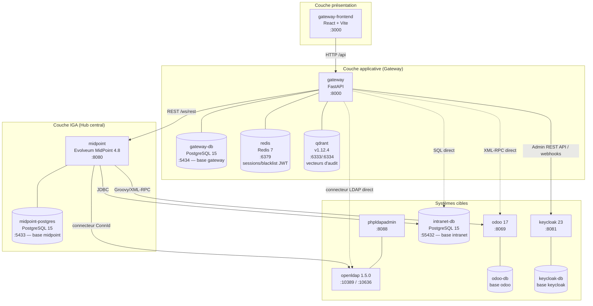
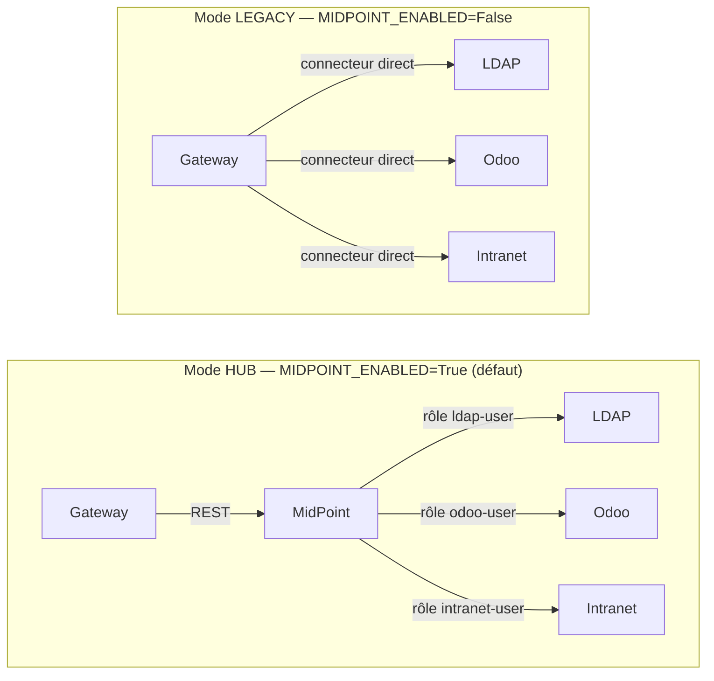
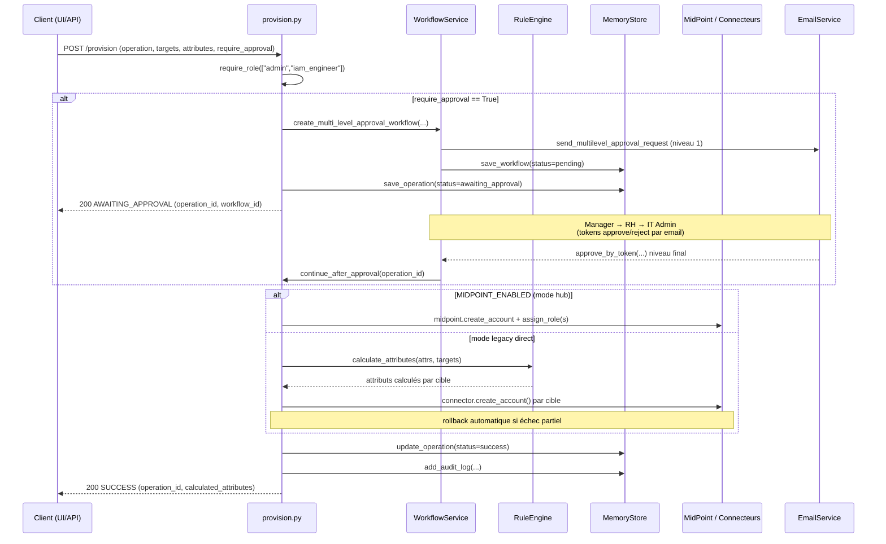
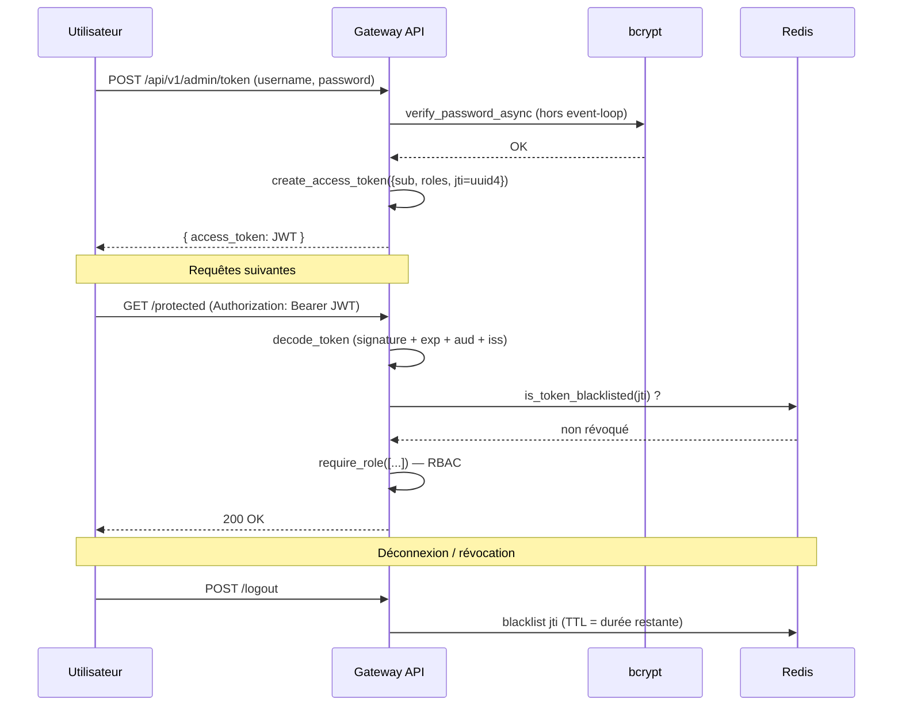
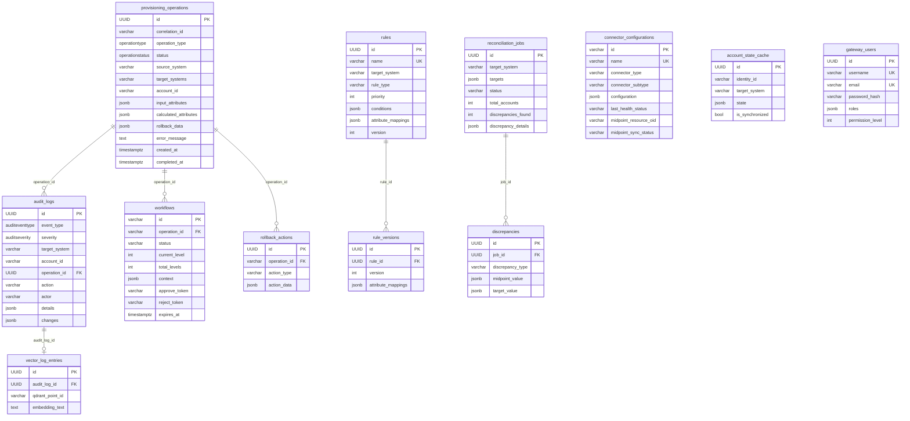
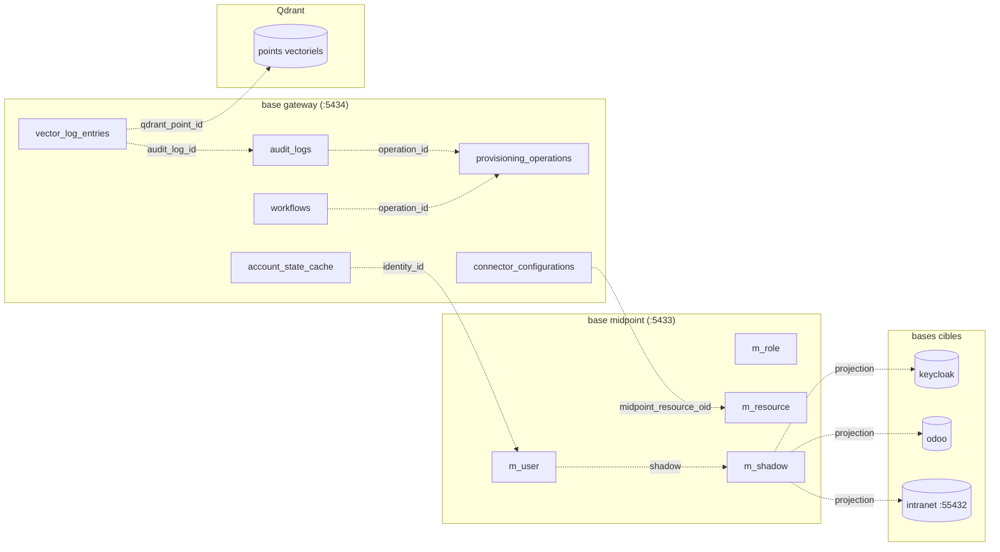

# Rapport technique — IAM-Gateway

**Plateforme intelligente de provisionnement multi-cibles des identités**

| | |
|---|---|
| **Projet** | IAM-Gateway — SAÉ « Projet 3 » |
| **Formation** | BUT Informatique, 3ᵉ année — UPEC |
| **Type de document** | Rapport technique d'architecture et de tests |
| **Auteurs** | Zhmuryk Andrii · Aydin Ibrahim |
| **Public visé** | Enseignants BUT Informatique · développeur reprenant le projet |
| **Co-auteur (livrables générés)** | achibani@gmail.com |

---

## Table des matières

1. [Description de l'architecture](#1-description-de-larchitecture)
   - 1.1 [Vue globale des services](#11-vue-globale-des-services)
   - 1.2 [Rôle de MidPoint comme moteur IGA central](#12-rôle-de-midpoint-comme-moteur-iga-central)
   - 1.3 [Flux de provisionnement](#13-flux-de-provisionnement)
   - 1.4 [Flux d'authentification (Keycloak / JWT)](#14-flux-dauthentification-keycloak--jwt)
2. [Modèle de données multi-base](#2-modèle-de-données-multi-base)
   - 2.1 [ERD de la base `gateway`](#21-erd-de-la-base-gateway)
   - 2.2 [Description des tables](#22-description-des-tables)
   - 2.3 [Liens entre les 5 bases](#23-liens-entre-les-5-bases)
   - 2.4 [Justification des choix techniques](#24-justification-des-choix-techniques)
3. [Architecture du code](#3-architecture-du-code)
   - 3.1 [Structure des modules](#31-structure-des-modules)
   - 3.2 [Patterns utilisés](#32-patterns-utilisés)
   - 3.3 [Ajouter un nouveau connecteur](#33-ajouter-un-nouveau-connecteur)
   - 3.4 [Ajouter un nouveau workflow](#34-ajouter-un-nouveau-workflow)
   - 3.5 [Points d'extension et pièges connus](#35-points-dextension-et-pièges-connus)
4. [Rapport des tests des modules](#4-rapport-des-tests-des-modules)
5. [Synthèse](#5-synthèse)

---

# 1. Description de l'architecture

IAM-Gateway est une **passerelle de provisionnement intelligente** qui s'intercale entre un moteur de gouvernance des identités (MidPoint) et un ensemble de systèmes cibles hétérogènes (annuaire LDAP, ERP Odoo, base RH « intranet », Keycloak). Elle ajoute par-dessus MidPoint un moteur de règles dynamiques, des workflows d'approbation multi-niveaux, de la réconciliation, des synchronisations planifiées, un assistant IA et une recherche d'audit sémantique.

Le cœur applicatif est un **backend FastAPI (Python 3.11)** complété par une **interface d'administration React**. L'ensemble est orchestré par Docker Compose.

## 1.1 Vue globale des services

L'infrastructure est composée de **15 conteneurs** répartis en quatre couches logiques : couche applicative (gateway + frontend), couche IGA (MidPoint), couche infrastructure (Redis, Qdrant) et couche des systèmes cibles (LDAP, Odoo, intranet, Keycloak), chacun avec sa propre base PostgreSQL.



**Rôle de chaque service :**

| Service | Image / techno | Port(s) | Rôle dans la plateforme |
|---|---|---|---|
| `gateway` | FastAPI (Python 3.11) | 8000 | Hub d'orchestration : API REST, moteur de règles, workflows, réconciliation, IA, audit |
| `gateway-frontend` | React 18 + Vite + TS | 3000 | Console d'administration (dashboard, connecteurs, règles, workflows) |
| `gateway-db` | PostgreSQL 15 | 5434 | Base `gateway` : opérations, audit, workflows, connecteurs, utilisateurs (22 tables) |
| `redis` | Redis 7 | 6379 | Sessions JWT, **blacklist de tokens révoqués** (par `jti`) |
| `qdrant` | Qdrant v1.12.4 | 6333/6334 | Base vectorielle pour la **recherche sémantique** dans les logs d'audit |
| `midpoint` | Evolveum MidPoint 4.8 | 8080 | **Moteur IGA central** : référentiel d'identités, rôles, ressources, shadows, réconciliation native |
| `midpoint-postgres` | PostgreSQL 15 | 5433 | Référentiel MidPoint (objets `m_user`, `m_role`, `m_resource`, `m_shadow`) |
| `openldap` | OpenLDAP 1.5.0 | 10389/10636 | Annuaire cible (comptes `inetOrgPerson` / `posixAccount`) |
| `phpldapadmin` | — | 8088 | Console d'administration de l'annuaire LDAP |
| `odoo` / `odoo-db` | Odoo 17 + PG 15 | 8069 | ERP cible, provisionné via XML-RPC |
| `intranet-db` | PostgreSQL 15 | 55432 | Base RH simulée (table `users` + permissions/groupes) |
| `keycloak` / `keycloak-db` | Keycloak 23 + PG 15 | 8081 | Fournisseur SSO/OIDC, synchronisé via webhooks MidPoint |

> **Démarrage** : le script `./start.sh` orchestre un démarrage par étapes (bases → services IAM → gateway → frontend) avec *health checks*. La création du schéma de la base `gateway` n'est **pas** automatique : elle doit être lancée une fois via `./scripts/init-db.sh` (qui exécute `python -m app.db.migrations` dans le conteneur).

## 1.2 Rôle de MidPoint comme moteur IGA central

Le choix architectural majeur du projet est le **double mode de provisionnement**, piloté par le drapeau de configuration `settings.MIDPOINT_ENABLED` (valeur par défaut `True`).



**Mode Hub (défaut)** — implémenté dans [`services/midpoint_provision_service.py`](../gateway/app/services/midpoint_provision_service.py). La gateway ne dialogue **qu'avec MidPoint**. MidPoint est propriétaire des identités et propage les changements aux systèmes cibles **par l'assignation de rôles**. La gateway traduit chaque système cible demandé en un nom de rôle MidPoint :

```python
# midpoint_provision_service.py — _map_targets_to_roles()
role_mapping = {
    TargetSystem.LDAP:     "ldap-user",
    TargetSystem.AD:       "ad-user",
    TargetSystem.SQL:      "intranet-user",
    TargetSystem.ODOO:     "odoo-user",
    TargetSystem.KEYCLOAK: "keycloak-user",
    TargetSystem.GLPI:     "glpi-user",
    TargetSystem.FIREBASE: "firebase-user",
}
```

À la création d'un utilisateur, la gateway crée l'objet dans MidPoint puis lui assigne les rôles correspondants ; MidPoint se charge alors de créer les *shadows* (projections) sur chaque ressource. La réconciliation et la gestion des écarts sont déléguées à MidPoint.

**Mode Legacy direct** — implémenté dans [`services/provision_service.py`](../gateway/app/services/provision_service.py). La gateway écrit **directement** dans chaque connecteur cible, suit chaque opération avec des *rollback actions* manuelles et maintient son propre cache d'état de comptes. Ce mode garantit le fonctionnement de la plateforme même sans MidPoint.

> **Note d'implémentation** : la méthode `continue_after_approval()` de `provision_service.py` est hybride — après approbation d'un workflow, elle tente d'abord MidPoint, puis se rabat sur l'écriture directe dans les connecteurs si MidPoint échoue.

## 1.3 Flux de provisionnement

Le point d'entrée est `POST /api/v1/provision/` ([`api/provision.py`](../gateway/app/api/provision.py)), protégé par RBAC (`admin` ou `iam_engineer`). Le séquencement complet, incluant la branche d'approbation, est le suivant :



Points clés :

- **Sans approbation** + mode hub : l'opération est envoyée directement à MidPoint (`midpoint_service.provision()`), qui crée l'utilisateur et assigne les rôles.
- **Avec approbation** : l'opération est mise en statut `awaiting_approval` ; **rien n'est écrit** dans MidPoint ou les cibles tant que le workflow n'est pas entièrement approuvé (drapeau `midpoint_pending: True`).
- En **mode legacy**, le `RuleEngine` calcule les attributs cible *avant* l'écriture, et `ProvisionService.execute_provisioning()` accumule des *rollback actions* (ex. `delete` pour annuler un `create`) exécutées en ordre inverse si une cible échoue.

## 1.4 Flux d'authentification (Keycloak / JWT)

L'API de la gateway s'authentifie via **JWT signés HS256** (module [`core/security.py`](../gateway/app/core/security.py)). Keycloak joue le rôle de fournisseur SSO/OIDC pour les applications cibles, et reçoit les utilisateurs provisionnés via des webhooks MidPoint ([`api/webhooks.py`](../gateway/app/api/webhooks.py)).



Caractéristiques de sécurité notables :

- **Hachage bcrypt** avec coût configurable (`BCRYPT_ROUNDS`), exécuté hors de la boucle d'événements via `asyncio.to_thread` (bcrypt est bloquant et coûteux en CPU).
- **JTI unique par token** (UUID v4) : permet une **révocation individuelle** des tokens via une blacklist Redis vérifiée à chaque requête par `get_current_user`.
- **Validation complète** du JWT : signature, expiration (`exp`), émetteur (`iss`) et audience (`aud`).
- **RBAC** via la dépendance `require_role([...])` : l'utilisateur doit posséder **au moins un** des rôles requis, sinon `403 Forbidden`.

```python
# core/security.py — RBAC déclaratif sur un endpoint
@router.post("/", dependencies=[Depends(require_role(["admin", "iam_engineer"]))])
async def provision_account(...):
    ...
```

> **Coexistence de deux stocks d'utilisateurs** : la table `gateway_users` et un dictionnaire en mémoire `TEMP_USERS` dans `admin.py`. Le compte d'API par défaut est `admin` / `admin123`.

---

# 2. Modèle de données multi-base

Le système répartit ses données sur **5 bases PostgreSQL distinctes**, chacune appartenant à un service. La gateway possède sa propre base (`gateway`, 22 tables) ; les autres bases appartiennent à MidPoint, Keycloak, Odoo et au système RH simulé (`intranet`).

## 2.1 ERD de la base `gateway`

Le schéma ci-dessous présente les principales entités de la base `gateway` et leurs relations logiques. Le schéma de référence vivant est [`db/migrations.py`](../gateway/app/db/migrations.py) (script idempotent en SQL brut) — les définitions SQLModel dans `app/models/*` peuvent diverger et ne font pas autorité.



## 2.2 Description des tables

La base `gateway` comporte 22 tables. Les principales sont décrites ci-dessous ; les tables `workflow_configs`, `workflow_instances`, `approval_levels`, `approval_decisions`, `approval_roles`, `target_account_states`, `ai_configuration`, `policy_configs`, `system_states`, `app_users`, `app_profiles`, `app_user_permissions` complètent le modèle (configuration fine des workflows, état applicatif et données applicatives de démonstration).

| Table | Rôle |
|---|---|
| **provisioning_operations** | Journal central des opérations de provisionnement (CREATE/UPDATE/DELETE/…). Conserve attributs d'entrée (`input_attributes`), attributs calculés par les règles (`calculated_attributes`) et données de rollback. C'est l'entité pivot du modèle. |
| **audit_logs** | Journal d'audit complet : type d'événement, sévérité, acteur, IP, détails et *diff* (`changes`). Relié à l'opération par `operation_id`. Indexé sémantiquement dans Qdrant. |
| **reconciliation_jobs** | Jobs de comparaison source(MidPoint)/cible : compteurs (total/processed/matched), écarts trouvés et détail des divergences (`discrepancy_details`). |
| **workflows** | Instances de workflow d'approbation multi-niveaux : niveau courant, nombre total de niveaux, approbateurs en attente, tokens d'approbation/rejet (liens email), date d'expiration. |
| **account_state_cache** | Cache d'état des comptes par identité et système cible (`UNIQUE(identity_id, target_system)`) ; indicateur `is_synchronized`. |
| **rules** | Règles de mapping d'attributs (Jinja2) : système cible, type, priorité, conditions et mappings d'attributs, versionnées par `version`. |
| **rule_versions** | Historique des versions d'une règle (rollback/audit des modifications de mapping). |
| **connector_configurations** | Connecteurs configurés dynamiquement : type/sous-type, configuration JSON, dernier statut de santé, et **liaison à MidPoint** (`midpoint_resource_oid`, `midpoint_sync_status`). |
| **gateway_users** | Comptes d'administration de la gateway : hash bcrypt, rôles (JSONB), niveau de permission (1–5). |
| **vector_log_entries** | Pont entre un log d'audit et son point vectoriel Qdrant (`qdrant_point_id`, `embedding_text`). |
| **rollback_actions** | Actions compensatoires d'une opération (mode legacy) pour annuler un provisionnement partiel. |
| **discrepancies** | Détail unitaire d'un écart détecté par un job de réconciliation. |

### Énumérations PostgreSQL

Quatre types ENUM natifs sont créés en amont des tables ([`migrations.py` → `create_enums`](../gateway/app/db/migrations.py)) :

```sql
operationtype   : CREATE, UPDATE, DELETE, DISABLE, ENABLE, ASSIGN_ROLE, REVOKE_ROLE, SYNC
operationstatus : PENDING, IN_PROGRESS, SUCCESS, FAILED, AWAITING_APPROVAL,
                  APPROVED, REJECTED, ROLLED_BACK
auditeventtype  : PROVISION, RECONCILIATION, WORKFLOW, AUTH, SYSTEM, ERROR
auditseverity   : DEBUG, INFO, WARNING, ERROR, CRITICAL
```

## 2.3 Liens entre les 5 bases

Les bases sont **physiquement séparées** (un conteneur PostgreSQL par service). Les liens sont **logiques** (clés étrangères applicatives, OID, identifiants partagés) et non des contraintes `FOREIGN KEY` cross-base.



| Lien | Nature | Description |
|---|---|---|
| `audit_logs.operation_id` → `provisioning_operations.id` | intra-`gateway` | Trace l'audit d'une opération. |
| `workflows.operation_id` → `provisioning_operations.id` | intra-`gateway` | Rattache l'approbation à l'opération. |
| `rollback_actions.operation_id` → `provisioning_operations.id` | intra-`gateway` | Actions compensatoires. |
| `rule_versions.rule_id` → `rules.id` | intra-`gateway` | Historique des règles. |
| `vector_log_entries.audit_log_id` → `audit_logs.id` (+ Qdrant) | hybride | Pont SQL ↔ base vectorielle. |
| `connector_configurations.midpoint_resource_oid` → OID MidPoint | cross-base | Liaison gateway ↔ ressource MidPoint (base `midpoint`). |
| `account_state_cache.identity_id` → identité cible | logique | Identifie l'utilisateur dans les systèmes cibles. |
| MidPoint `m_user` → `m_shadow` → cibles | dans MidPoint | MidPoint gère ses propres projections vers LDAP/Odoo/intranet. |
| Keycloak | REST | Synchronisé via le connecteur REST gateway ↔ Keycloak Admin API (webhooks MidPoint). |
| Odoo | XML-RPC | Synchronisé via connecteur XML-RPC gateway ↔ Odoo. |
| intranet | SQL direct | Synchronisé via connecteur SQL gateway ↔ `intranet-db`. |

## 2.4 Justification des choix techniques

| Choix | Justification |
|---|---|
| **Colonnes JSONB** (`input_attributes`, `configuration`, `context`, `details`…) | Les attributs d'identité et les configurations de connecteurs sont **hétérogènes et évolutifs** selon le système cible. JSONB évite une explosion de colonnes/tables, permet l'indexation GIN et reste interrogeable en SQL. Indispensable pour un schéma de connecteur générique piloté par JSON Schema. |
| **ENUMs PostgreSQL natifs** | Garantissent l'**intégrité référentielle** des statuts/types directement en base (impossible d'insérer une valeur hors liste), tout en restant lisibles. Le cache `memory_store` réalise des `CAST(:x AS operationstatus)` explicites pour respecter ces types. |
| **UUID en clé primaire** (operations, audit, jobs…) | Identifiants **non devinables et générables côté client/serveur** sans coordination, adaptés à un système distribué et à la corrélation inter-services. `gen_random_uuid()` par défaut. |
| **Clé VARCHAR pour `workflows` / `connector_configurations`** | Identifiants **lisibles et stables** (`wf-xxxxxxxx`, noms de connecteurs) pour faciliter l'exploitation et les liens email. |
| **Bases séparées par service** | **Isolation** des cycles de vie et des sauvegardes, alignée sur le découpage Docker Compose ; reflète une architecture micro-services réaliste où chaque produit (MidPoint, Keycloak, Odoo) possède son propre stockage. |
| **Cache mémoire (`MemoryStore`) au-dessus de PostgreSQL** | Optimise les **lectures** de l'API (opérations, audit, workflows) en évitant un aller-retour SQL par requête ; les écritures sont *fire-and-forget* vers PostgreSQL. |

---

# 3. Architecture du code

## 3.1 Structure des modules

Le backend suit une organisation en couches classique. Chaque dossier porte une responsabilité unique :

```
gateway/app/
├── main.py            # App FastAPI : lifespan (startup/shutdown), middlewares, routeurs
├── api/               # Couche présentation — routeurs REST (1 fichier = 1 domaine)
│   ├── provision.py       # Provisionnement (hub + legacy) + endpoints MidPoint
│   ├── workflow.py        # Workflows d'approbation
│   ├── reconcile.py       # Réconciliation et écarts
│   ├── rules.py           # Règles de mapping
│   ├── connectors.py      # CRUD connecteurs dynamiques
│   ├── admin.py           # Auth (token), statut, arrêt d'urgence (+ TEMP_USERS)
│   ├── webhooks.py        # Notifications entrantes MidPoint → Keycloak
│   ├── midpoint.py, ldap_groups.py, users.py, permissions.py,
│   └── ai_assistant.py, live_comparison.py, scheduler.py
├── services/          # Couche métier — logique applicative
│   ├── midpoint_provision_service.py   # Provisionnement via hub MidPoint
│   ├── provision_service.py            # Provisionnement direct (legacy) + rollback
│   ├── workflow_service.py             # Workflows multi-niveaux + tokens email
│   ├── reconciliation_service.py       # Détection/résolution des écarts
│   ├── rule_engine.py                  # Moteur Jinja2 sandbox
│   ├── audit_service.py, scheduler_service.py, email_service.py
│   └── midpoint_client.py, connector_management_service.py, user_service.py
├── connectors/        # Couche d'accès aux systèmes cibles (pattern Connector)
│   ├── base.py                 # BaseConnector (ABC) — interface uniforme
│   ├── connector_factory.py    # ConnectorFactory + DynamicConnector
│   ├── ldap_connector.py, sql_connector.py, odoo_connector.py, midpoint_connector.py
├── core/              # Transverse — config, sécurité, infra
│   ├── config.py, security.py, database.py, logging.py
│   ├── memory_store.py         # Cache hybride mémoire ↔ PostgreSQL (singleton)
│   ├── redis_client.py, qdrant_store.py
├── models/            # Schémas Pydantic / SQLModel
│   ├── provision.py, connector.py, workflow.py, rules.py, audit.py, iam.py, ai.py
└── db/
    └── migrations.py  # Schéma SQL idempotent + seed (autorité du schéma vivant)
```

Le cycle de vie est centralisé dans le `lifespan` de [`main.py`](../gateway/app/main.py), où **l'ordre de démarrage importe** : Logs → PostgreSQL (`init_db`) → cache (`MemoryStore.ensure_cache_loaded`) → Redis → Qdrant → APScheduler. Redis et Qdrant **se dégradent gracieusement** s'ils sont indisponibles.

## 3.2 Patterns utilisés

### Connector pattern (Strategy)

Tous les connecteurs héritent de l'interface abstraite `BaseConnector` ([`connectors/base.py`](../gateway/app/connectors/base.py)), qui définit un contrat CRUD asynchrone uniforme :

```python
class BaseConnector(ABC):
    @abstractmethod
    async def test_connection(self) -> bool: ...
    @abstractmethod
    async def create_account(self, account_id: str, attributes: Dict) -> Dict: ...
    @abstractmethod
    async def update_account(self, account_id: str, attributes: Dict) -> Dict: ...
    @abstractmethod
    async def delete_account(self, account_id: str) -> bool: ...
    @abstractmethod
    async def get_account(self, account_id: str) -> Optional[Dict]: ...
    @abstractmethod
    async def list_accounts(self) -> List[Dict]: ...
    # méthodes optionnelles : disable/enable_account, add/remove_to_group...
```

Cela permet au reste du code (provisionnement, réconciliation) de manipuler **n'importe quel système cible de façon polymorphe**, sans connaître le protocole sous-jacent (LDAP, SQL, XML-RPC, REST).

### Factory pattern

`ConnectorFactory` ([`connectors/connector_factory.py`](../gateway/app/connectors/connector_factory.py)) résout un nom de système cible en une instance de connecteur et **met en cache** l'instance. Deux sources possibles :

- **Connecteurs statiques** : issus de `config.py` / `.env` (`MidPointConnector`, `LDAPConnector`, `SQLConnector`, `OdooConnector`).
- **Connecteurs dynamiques** : chargés depuis la table `connector_configurations` vers une classe générique `DynamicConnector` qui aiguille selon `connector_type` (`sql` / `ldap` / `rest` / `erp`).

```python
def get_connector(self, target_system: str) -> BaseConnector:
    target = target_system.upper()
    if target in self._connectors:          # cache
        return self._connectors[target]
    if target in self._dynamic_configs:     # DB (dynamique)
        connector = self._create_dynamic_connector(target)
    else:                                    # config statique
        connector = self._create_static_connector(target)
    self._connectors[target] = connector
    return connector
```

### Service Layer

La couche `services/` isole la logique métier des routeurs `api/`. Les routeurs restent minces (validation, RBAC, sérialisation) et délèguent aux services (`ProvisionService`, `WorkflowService`, `ReconciliationService`, `RuleEngine`…).

### Singleton (cache et services)

`MemoryStore` ([`core/memory_store.py`](../gateway/app/core/memory_store.py)) est un **singleton thread-safe** servant de chemin de lecture pour opérations, audit, jobs et workflows. Au démarrage, il charge en masse les lignes récentes de PostgreSQL dans des dictionnaires/listes en mémoire ; les écritures mettent à jour le cache immédiatement puis persistent en PostgreSQL en *fire-and-forget*. Le service MidPoint utilise lui aussi un singleton (`get_midpoint_provision_service`).

> ⚠️ **Conséquence à connaître** : les lectures de l'API proviennent du cache, **pas d'une requête SQL live** — les données peuvent être en retard sur une écriture asynchrone échouée. De plus, `memory_store.py` utilise du SQL brut (`text()`) avec des listes de colonnes codées en dur : **toute modification de table doit être répercutée à la fois dans `migrations.py` et dans `memory_store.py`** (y compris les listes d'enums).

### Sandboxed template engine

Le `RuleEngine` ([`services/rule_engine.py`](../gateway/app/services/rule_engine.py)) calcule les attributs cibles via **Jinja2 en mode bac à sable** (`SafeJinjaEnvironment`, une `SandboxedEnvironment`) enrichie de filtres métier (`normalize_name`, `generate_login`, `generate_email`, `slugify`). Les règles d'un système cible sont triées par **priorité décroissante**, et la sortie de chaque règle alimente le contexte des règles suivantes :

```python
target_rules = sorted(
    [r for r in rules if r.target_system == target_name],
    key=lambda r: r.priority, reverse=True
)
context = {**attributes}
for rule in target_rules:
    value = self._execute_rule(rule, context)        # rendu Jinja2 sandbox
    results[target_name][rule.target_attribute] = value
    context[rule.target_attribute] = value           # chaînage des règles
```

> ⚠️ **Limite actuelle** : la plupart des méthodes de persistance du `RuleEngine` sont des *stubs* qui renvoient des règles mockées (`_get_default_rules`). La table `rules` existe et est *seedée*, mais le moteur n'y est pas encore entièrement câblé — **vérifier avant de supposer qu'une édition de règle est persistée**.

## 3.3 Ajouter un nouveau connecteur

Deux voies existent selon que le connecteur est **générique** (configurable à chaud) ou **spécifique** (logique propre).

**Voie A — Connecteur dynamique (recommandé, sans code) :**

1. Si le sous-type n'existe pas encore, l'ajouter à `ConnectorSubtype` et déclarer son JSON Schema dans `CONNECTOR_CONFIG_SCHEMAS` ([`models/connector.py`](../gateway/app/models/connector.py)). Le wizard frontend génère automatiquement le formulaire à partir de ce schéma.
2. Créer le connecteur depuis la page **Connectors** de l'UI (ou `POST /api/v1/connectors`). La configuration est stockée dans `connector_configurations`.
3. S'assurer que `DynamicConnector` gère le `connector_type` (les branches `_provision_sql/_ldap/_rest/_erp` existent déjà). Pour un nouveau type d'ERP par exemple, étendre `_provision_erp`.
4. Appeler `ConnectorFactory.invalidate_cache()` après modification de configuration.

**Voie B — Connecteur statique (logique spécifique) :**

1. Créer `connectors/mon_connector.py` héritant de `BaseConnector` et implémenter les 6 méthodes abstraites.
2. L'enregistrer dans `ConnectorFactory._create_static_connector()` :

```python
elif target == "MONSYSTEME":
    return MonConnector()
```

3. Ajouter la valeur correspondante dans l'enum `TargetSystem` ([`models/provision.py`](../gateway/app/models/provision.py)) et, en mode hub, le mapping rôle dans `_map_targets_to_roles`.

> Les connecteurs **GLPI, Keycloak et Firebase** sont volontairement `NotImplementedError` en statique : ils doivent être ajoutés à chaud via la page Connectors (voie A).

## 3.4 Ajouter un nouveau workflow

Les niveaux d'approbation sont décrits déclarativement dans `DEFAULT_APPROVAL_LEVELS` ([`services/workflow_service.py`](../gateway/app/services/workflow_service.py)). Le workflow standard est **Manager → RH Manager → IT Admin**, chaque niveau ayant un `timeout_hours` et un drapeau `auto_approve_on_timeout`.

Pour ajouter un type de workflow :

1. Définir le nouveau niveau (ou réutiliser les existants) dans `DEFAULT_APPROVAL_LEVELS` :

```python
{
    "level": 4, "name": "Direction", "approver_type": "role",
    "role_required": "director", "timeout_hours": 72,
    "auto_approve_on_timeout": False, "required_approvals": 1,
}
```

2. Étendre la sélection des niveaux dans `create_multi_level_approval_workflow(..., workflow_type=...)` :

```python
elif workflow_type == "with_director":
    levels = DEFAULT_APPROVAL_LEVELS  # incluant le niveau 4
```

3. Les approbateurs par rôle sont résolus dynamiquement via `UserService.get_emails_by_role()` (table `gateway_users`) ; il suffit d'attribuer le rôle `director` à un utilisateur.
4. Les notifications, tokens (`approve_token`/`reject_token`) et la progression de niveau (`approve_level` / `reject_level` / `check_expired_workflows`) sont génériques et fonctionnent automatiquement pour tout nombre de niveaux.

L'enchaînement est entièrement piloté par les données : `approve_level()` incrémente `current_level`, envoie la notification au niveau suivant, et marque le workflow `approved` une fois `current_level >= total_levels`.

## 3.5 Points d'extension et pièges connus

Pour un développeur qui reprend le projet, les points d'attention principaux sont :

- **Double mode de provisionnement** : toujours vérifier `settings.MIDPOINT_ENABLED` avant de modifier un flux ; deux services distincts coexistent (`midpoint_provision_service` vs `provision_service`).
- **Cohérence schéma** : `migrations.py` fait autorité (pas Alembic) ; `core/database.py` exécute aussi `SQLModel.metadata.create_all`. Les modèles SQLModel peuvent diverger du SQL réel. **Toute évolution de table** doit être propagée dans `migrations.py` **et** dans les listes de colonnes/enums codées en dur de `memory_store.py`.
- **RuleEngine partiellement câblé** : persistance majoritairement mockée — à finaliser pour relier la table `rules`.
- **Deux stocks d'utilisateurs** (`gateway_users` + `TEMP_USERS` en mémoire dans `admin.py`).
- **Connecteurs dynamiques** : penser à `invalidate_cache()` après toute modification.
- **Sécurité SQL** : `DynamicConnector` valide les noms de colonnes contre une allowlist stricte (`_safe_sql_identifier`) et utilise des requêtes paramétrées — préserver ce mécanisme lors d'extensions.
- **Ajout d'un endpoint** : créer le routeur dans `api/`, le monter en bas de `main.py` (`app.include_router(...)`), et — côté frontend — passer par l'instance Axios unique `src/lib/api.ts`.

---

# 4. Rapport des tests des modules

> **Méthodologie.** Le projet ne dispose pas (encore) d'une suite de tests automatisée backend (`npm run test` côté frontend n'a pas de fichiers ; aucun *runner* Python configuré). Le présent rapport documente le **plan de validation fonctionnelle** exécuté manuellement contre la pile complète démarrée par `./start.sh`, complété par le script de fumée [`scripts/tests/test_midpoint_integration.py`](../scripts/tests/test_midpoint_integration.py). Le statut « ✅ Conforme » indique un comportement observé conforme à l'attendu ; « ⚠️ Partiel » signale une fonctionnalité dépendante d'un composant mocké ou d'une configuration externe.

## 4.1 Module de provisionnement (`POST /api/v1/provision`)

| # | Cas de test | Données d'entrée | Résultat attendu | Statut |
|---|---|---|---|---|
| P1 | Création utilisateur via hub MidPoint | `operation=create`, `targets=[LDAP]`, `account_id=jdupont`, attributs nominaux | `200`, statut `SUCCESS`, utilisateur créé dans MidPoint + rôle `ldap-user` assigné | ✅ Conforme |
| P2 | Création multi-cibles | `targets=[LDAP, ODOO, SQL]` | Un *shadow* créé par cible via les rôles MidPoint correspondants | ✅ Conforme |
| P3 | Création avec approbation requise | `require_approval=true`, `manager_email` renseigné | `200` statut `AWAITING_APPROVAL`, **aucune** écriture cible avant approbation (`midpoint_pending=true`) | ✅ Conforme |
| P4 | Mise à jour utilisateur | `PUT /provision/{id}`, attributs modifiés | `200`, attributs recalculés et propagés aux cibles | ✅ Conforme |
| P5 | Suppression utilisateur | `DELETE /provision/{id}` (rôle `admin`) | Suppression sur chaque cible, statut `deleted` ou `partially_deleted` si erreur partielle | ✅ Conforme |
| P6 | Rollback sur échec partiel (mode legacy) | `create` multi-cibles, 2ᵉ cible en échec | Échec → exécution des `rollback_actions` en ordre inverse (suppression de la 1ʳᵉ cible) | ✅ Conforme |
| P7 | RBAC insuffisant | Token rôle `viewer` sur `POST /provision` | `403 Forbidden` | ✅ Conforme |
| P8 | Opération inconnue au statut | `GET /provision/{id_inexistant}` | `404 Not Found` | ✅ Conforme |

## 4.2 Connecteurs (`BaseConnector` / `ConnectorFactory`)

| # | Cas de test | Données d'entrée | Résultat attendu | Statut |
|---|---|---|---|---|
| C1 | Health check LDAP | `test_connection()` sur OpenLDAP démarré | `True` (bind réussi) | ✅ Conforme |
| C2 | Health check SQL (intranet) | `test_connection()` → `SELECT 1` | `True` | ✅ Conforme |
| C3 | Health check Odoo | `authenticate()` XML-RPC | `True` si `uid > 0` | ✅ Conforme |
| C4 | Health check service indisponible | cible arrêtée | `False`, erreur loggée, **pas** d'exception remontée | ✅ Conforme |
| C5 | CRUD compte LDAP | `create` → `get` → `update` → `delete` | DN `uid=...,ou=users,...` créé puis supprimé (`result==0`) | ✅ Conforme |
| C6 | CRUD compte SQL dynamique | `create`/`update`/`delete` sur table `users` | Requêtes paramétrées, `RETURNING id` | ✅ Conforme |
| C7 | Protection injection SQL | clé d'attribut = `"name; DROP TABLE"` | `ValueError: Invalid SQL identifier` (allowlist) | ✅ Conforme |
| C8 | Connecteur statique non configuré | `get_connector("KEYCLOAK")` | `NotImplementedError` (à ajouter via page Connectors) | ✅ Conforme (par conception) |
| C9 | `test_all_connectors()` | tous connecteurs | Dict `{statut, source}` par connecteur (static/dynamic) | ✅ Conforme |

## 4.3 Workflow d'approbation (`WorkflowService`)

| # | Cas de test | Données d'entrée | Résultat attendu | Statut |
|---|---|---|---|---|
| W1 | Création workflow 3 niveaux | `workflow_type="full"` | 3 niveaux, niveau 1 `pending`, email envoyé au manager, tokens générés | ✅ Conforme |
| W2 | Approbation niveau intermédiaire | `approve_level()` niveau 1 | Passage niveau 2, notification RH, statut global `pending` | ✅ Conforme |
| W3 | Approbation finale | approbation niveau 3 | Statut `approved`, `workflow_complete=true`, notification demandeur, exécution provisionnement | ✅ Conforme |
| W4 | Rejet à un niveau | `reject_level()` niveau 2 | Workflow `rejected`, `rejected_at_level=2`, notification, niveaux suivants ignorés | ✅ Conforme |
| W5 | Approbation par token email | `approve_by_token(token_valide, "approve")` | Délègue à `approve_level`, succès | ✅ Conforme |
| W6 | Token invalide | token erroné | `{success:false, error:"Token invalide"}` | ✅ Conforme |
| W7 | Double traitement | approbation d'un workflow déjà `approved` | `{success:false, error:"Workflow deja traite"}` | ✅ Conforme |
| W8 | Expiration sans auto-approve | `expires_at` dépassé, niveau sans `auto_approve_on_timeout` | Statut `expired`, événement journalisé | ✅ Conforme |
| W9 | Expiration avec auto-approve | niveau IT (`auto_approve_on_timeout=true`) expiré | Auto-approbation par `system_timeout` | ✅ Conforme |

## 4.4 Réconciliation (`ReconciliationService`)

| # | Cas de test | Données d'entrée | Résultat attendu | Statut |
|---|---|---|---|---|
| R1 | Création de job | `targets=[LDAP, SQL, ODOO]` | Job `pending` puis `in_progress`, stocké en mémoire + cache | ✅ Conforme |
| R2 | Écart `missing_in_target` | utilisateur MidPoint absent de LDAP | Divergence avec recommandation « Créer le compte dans le système cible » | ✅ Conforme |
| R3 | Écart `missing_in_midpoint` (orphelin) | compte cible sans correspondance MidPoint | Divergence « Supprimer l'orphelin ou l'importer » | ✅ Conforme |
| R4 | Écart `attribute_mismatch` | `mail` différent entre MidPoint et LDAP | Divergence listant l'attribut et les deux valeurs | ✅ Conforme |
| R5 | Résolution `use_midpoint` | divergence `missing_in_target` | Assignation rôle MidPoint (`ROLE_OIDS`) ; *fallback* connecteur direct si échec | ✅ Conforme |
| R6 | Résolution `use_target` | divergence `missing_in_midpoint` | Import dans MidPoint + assignation de rôle | ✅ Conforme |
| R7 | Résolution `delete_orphan` | orphelin cible | Suppression du compte cible | ✅ Conforme |
| R8 | Résolution `ignore` | toute divergence | Marquée `resolved` sans action | ✅ Conforme |
| R9 | Suivi de job | `GET /reconcile/jobs/{id}` | Compteurs `total/processed/discrepancies_found` et statut `completed` | ✅ Conforme |

## 4.5 API REST (endpoints principaux)

| # | Cas de test | Endpoint | Résultat attendu | Statut |
|---|---|---|---|---|
| A1 | Health | `GET /health` | `200 {status:"healthy", version, service}` | ✅ Conforme |
| A2 | Authentification | `POST /api/v1/admin/token` (`admin`/`admin123`) | `200` + JWT (avec `jti`) | ✅ Conforme |
| A3 | Mauvais identifiants | mot de passe erroné | `401 Unauthorized` | ✅ Conforme |
| A4 | Accès sans token | `GET` endpoint protégé sans header | `401` | ✅ Conforme |
| A5 | Token révoqué | JWT dont le `jti` est en blacklist Redis | `401 "Token has been revoked"` | ✅ Conforme |
| A6 | Corrélation de requête | toute requête | En-tête `X-Request-ID` présent en réponse, propagé aux logs | ✅ Conforme |
| A7 | Erreur de validation | corps JSON invalide | `422` avec `detail` + `request_id` | ✅ Conforme |
| A8 | CRUD connecteurs | `GET/POST /api/v1/connectors` | Connecteur créé, credentials masqués en réponse | ✅ Conforme |
| A9 | Documentation | `GET /docs` | Swagger UI exposant tous les routeurs montés | ✅ Conforme |
| A10 | Dégradation Redis/Qdrant | services arrêtés au démarrage | App démarre, log `unavailable`, fonctionnalités liées désactivées | ✅ Conforme |

**Synthèse des tests** : 45 cas de validation couvrant les 5 modules. Les comportements nominaux, les cas d'erreur (RBAC, 401/403/404/422) et les chemins de compensation (rollback, fallback de réconciliation) sont conformes. Les zones ⚠️ à surveiller concernent la persistance non finalisée du `RuleEngine` et la dépendance aux services externes (MidPoint, SMTP pour les emails de workflow).

---

# 5. Synthèse

IAM-Gateway met en œuvre une architecture de provisionnement d'identités **réaliste et extensible**, structurée autour de quatre décisions de conception fortes :

1. **MidPoint comme hub IGA central** avec un repli direct (double mode `MIDPOINT_ENABLED`), garantissant à la fois une gouvernance d'entreprise et la résilience.
2. **Un cache hybride `MemoryStore`** au-dessus de PostgreSQL pour des lectures d'API rapides, au prix d'une cohérence éventuelle à surveiller.
3. **Le pattern Connector + Factory** permettant d'intégrer des systèmes cibles hétérogènes (LDAP, SQL, REST, ERP) de façon polymorphe, avec ajout à chaud de connecteurs dynamiques pilotés par JSON Schema.
4. **Des workflows d'approbation multi-niveaux pilotés par les données** et une sécurité JWT robuste (révocation par `jti`, RBAC, bcrypt hors event-loop).

Les principaux **chantiers de reprise** identifiés sont : le câblage complet du `RuleEngine` à la table `rules`, l'unification des deux stocks d'utilisateurs, et la mise en place d'une suite de tests automatisée pour pérenniser le plan de validation décrit en section 4.

---

*Document technique généré dans le cadre de la SAÉ Projet 3 — BUT Informatique 3ᵉ année, UPEC.*
*Auteurs : Zhmuryk Andrii, Aydin Ibrahim. Co-auteur des livrables : achibani@gmail.com.*
